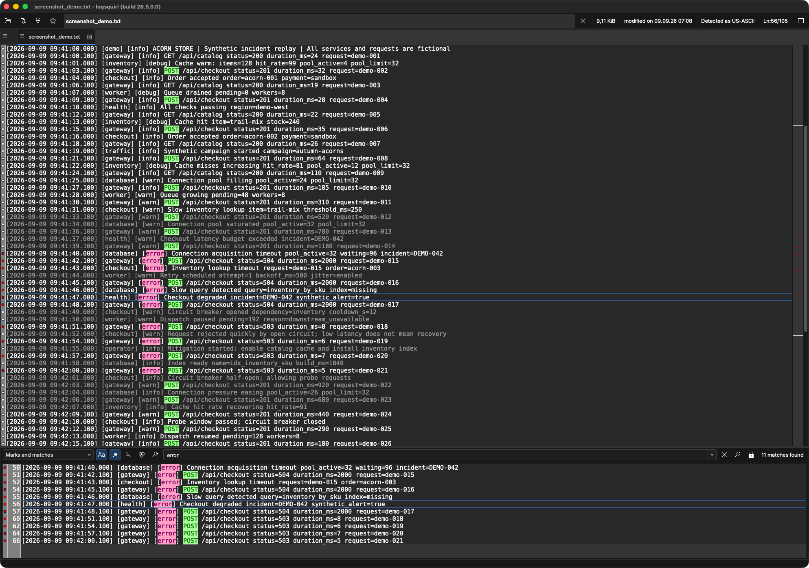

<!-- Allow GitHub's presentation markup and a logo before the main heading. -->
<!-- markdownlint-configure-file {"MD033": {"allowed_elements": ["div", "img"]}, "MD041": false} -->

# LogSquirl

**Big logs. Clear answers.**

**A fast, open-source log explorer for Windows, macOS, and Linux.**

Search huge files, follow live logs, and turn noisy output into something you can actually work with.

[Why LogSquirl?](#why-logsquirl) · [Get started](#get-started) · [Features](#features) · [Plugins](#plugins) · [Contribute](#contributing)

*Follow the incident, highlight the clues, and keep matching lines in view.
Captured on macOS with fictional demo data; the local file path is anonymized.*

---

## Why LogSquirl?

Your editor struggles with the file. Your terminal shows the match, but not the whole story.
LogSquirl brings **grep, less, and tail** into one desktop app so you can find what happened
without losing the context.

| Less friction | More insight |
| :--- | :--- |
| **Open the big one.** Work with multi-gigabyte logs without loading the entire file into memory. | **Find the signal.** Combine regex searches with AND, OR, and NOT, then inspect matches alongside the source. |
| **Stay with the action.** Follow growing files and reload automatically when they change. | **See the structure.** Detect supported log formats and switch between raw text and a column-based table view. |
| **Skip the unpacking.** Open compressed logs and tarballs directly. | **Spot the pattern.** Chart numeric values, message rates, and filter frequency over time. |

## Get started

### 1. Grab your build

**[Download the latest release](https://github.com/64x-lunicorn/LogSquirl/releases/latest)**
and choose the package for your platform.

| Windows | macOS | Linux |
| :--- | :--- | :--- |
| NSIS installer | `.pkg` installer | AppImage, DEB, or RPM |

See the release notes for package details and platform requirements.

### 2. Find your first clue

1. **Open a log file** you want to investigate.
2. **Search for a keyword or regex** such as `ERROR|WARN|timeout` with regex mode enabled.
3. **Select a match** to inspect the surrounding lines in the original log.
4. **Enable follow mode** to keep watching as new lines arrive.

Need a log to try? Open the [fictional incident demo](test_data/screenshot_demo.txt)
and follow a service from healthy traffic through timeouts to recovery.
The [user guide](DOCUMENTATION.md) covers filters, charts, and keyboard shortcuts.

## Features

### Fast where it matters

Multi-threaded, SIMD-optimized search. Persistent index caching for reopening files.
Automatic encoding detection. Direct support for `.gz`, `.bz2`, `.xz`, `.zst`, `.lz4`,
and tarballs.

### Make the important parts stand out

Save and group filters, pin them across sessions, and switch between color highlighter sets.
Browse supported formats as structured tables, or chart values and jump from a data point
straight to its log line. Reuse chart templates and share presets as JSON.

### Keep your investigation in one place

Dark mode, configurable shortcuts, and a Command Palette (`Ctrl+Shift+P`) for quick access.
A Scratchpad for notes, data transformations, and JWT decoding.

**Go deeper:** [Log formats](DOCUMENTATION.md#auto-log-format-detection-table-view) ·
[Chart Panel](DOCUMENTATION.md#chart-panel) · [Full user guide](DOCUMENTATION.md)

## Plugins

**Your logs do not have to start in a file.**
Extend LogSquirl with data sources, format converters, and custom UI actions.

| Plugin | What it brings |
| :--- | :--- |
| [Android Logcat](https://github.com/64x-lunicorn/LogSquirl-Logcat) | Stream logcat output from ADB devices. |
| [Serial Monitor](https://github.com/64x-lunicorn/LogSquirl-Serial) | Stream data from serial ports. |

Use **Plugins → Browse Plugins…** to discover and download plugins, and
**Plugins → Manage Plugins…** to manage them.

Want to build your own? The C ABI supports **DataSource**, **Converter**, and **UI Extension**
plugins. Lua scripting is also available in builds configured with `LOGSQUIRL_USE_LUA=ON`.

[Explore the registry](https://github.com/64x-lunicorn/LogSquirl-Plugins) ·
[Read the Plugin SDK guide](docs/plugin-sdk.md) ·
[Publish a plugin](https://github.com/64x-lunicorn/LogSquirl-Plugins/blob/main/CONTRIBUTING.md)

## Building

LogSquirl is built with **C++23** and **Qt6**, using **CMake** and
[CPM](https://github.com/cpm-cmake/CPM.cmake) for dependency management.

You will need a C++23 compiler (GCC 13+, Clang 17+, or MSVC 19.36+), Qt 6.5+,
and CMake 3.12+, along with the platform-specific dependencies.

**[Follow the build guide](BUILD.md)** for setup, build options, and testing instructions.

## How to get help

| Looking for… | Start here |
| :--- | :--- |
| Usage, settings, and shortcuts | [User guide](DOCUMENTATION.md) |
| New features and fixes | [Changelog](CHANGELOG.md) |
| A known issue or workaround | [Search existing issues](https://github.com/64x-lunicorn/LogSquirl/issues) |
| A bug report or feature request | [Open an issue](https://github.com/64x-lunicorn/LogSquirl/issues/new/choose) |

## Contributing

Help make the next log investigation a little easier.
Bug reports, feature ideas, documentation improvements, plugins, and code contributions
are all welcome.

Read the [contributing guide](CONTRIBUTING.md) to get started.
If LogSquirl helps you, **give it a star** or share it with someone who spends too much
time scrolling through logs.

## About the project

LogSquirl is a fork of [klogg](https://github.com/variar/klogg), which itself started as a fork of
[glogg](https://github.com/nickbnf/glogg) - the fast, smart log explorer.

Since the original klogg project is no longer actively maintained, LogSquirl continues
development under a new name, building on the excellent foundation laid by both glogg and klogg.

LogSquirl is standing on the shoulders of giants.

### Acknowledgements

**[LogSquirl](https://github.com/64x-lunicorn/LogSquirl)** is built by
[64x-Lunicorn](https://github.com/64x-lunicorn) on the work of:

- **[klogg](https://github.com/variar/klogg)** by
  [Anton Filimonov](https://github.com/variar) and contributors (GPL-3.0).
- **[glogg](https://github.com/nickbnf/glogg)** by
  [Nicolas Bonnefon](https://github.com/nickbnf) (GPL-3.0).

See [NOTICE](NOTICE) for third-party components and their licenses.

### License

Free and open source under the **GNU General Public License v3.0 or later**.
See [COPYING](COPYING) for the full license.

---

**Less scrolling. More investigating.**

[Download LogSquirl](https://github.com/64x-lunicorn/LogSquirl/releases/latest) ·
[Read the docs](DOCUMENTATION.md) ·
[Back to top](#logsquirl)

