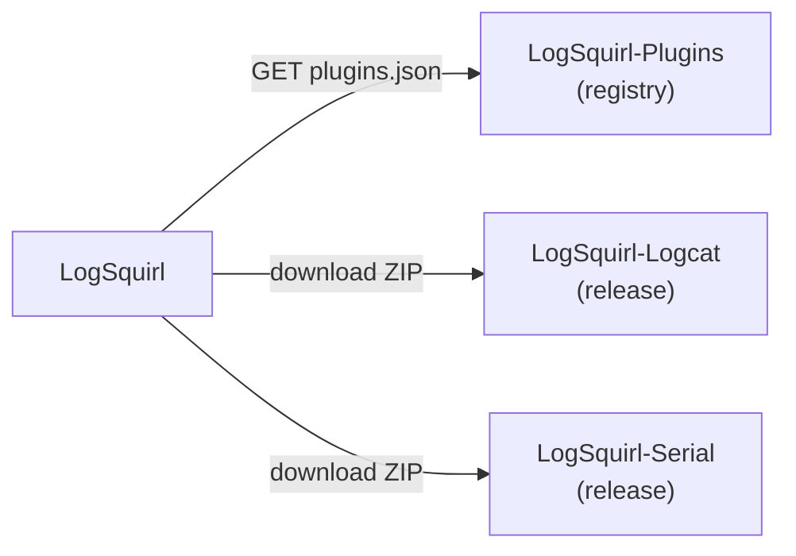

# LogSquirl

A fast, smart log file explorer.

> **This is a fork of the project [klogg](https://github.com/variar/klogg).**
> This fork has been renamed to "LogSquirl" and further developed.
> All changes are documented in the Git history.

## Overview

LogSquirl is a multi-platform GUI application that helps browse and search
through long and complex log files. It is designed with programmers and
system administrators in mind and can be seen as a graphical, interactive
combination of grep, less, and tail.

Please refer to the
[documentation](DOCUMENTATION.md)
page for how to use LogSquirl.

## Table of Contents

1. [About the Project](#about-the-project)
1. [Features](#features)
1. [Plugins](#plugins)
1. [Installation](#installation)
1. [Building](#building)
1. [How to Get Help](#how-to-get-help)
1. [Contributing](#contributing)
1. [License](#license)
1. [Acknowledgements](#acknowledgements)

## About the Project

LogSquirl is a fork of [klogg](https://github.com/variar/klogg), which itself started as a fork of
[glogg](https://github.com/nickbnf/glogg) - the fast, smart log explorer.

Since the original klogg project is no longer actively maintained, LogSquirl continues
development under a new name, building on the excellent foundation laid by both glogg and klogg.

LogSquirl is standing on the shoulders of giants.

The project is built with **C++23** and **Qt6**, and uses
[CMake](https://cmake.org/) with [CPM](https://github.com/cpm-cmake/CPM.cmake)
for dependency management.

## Features

* Runs on Linux, Windows, and macOS thanks to Qt6
* Reads files directly from disk without loading them into memory
* Can operate on huge text files (10+ GB is not a problem)
* Search results are displayed separately from the original file
* Supports Perl-compatible regular expressions
* Colorizes the log and search results
* Displays a context view of where in the log the lines of interest are
* Watches for file changes on disk and reloads automatically (like tail)
* Is heavily optimized using multi-threading and SIMD
* Supports files with more than 2 billion lines
* Includes much faster regular expression search (2-4x)
* Allows combining regular expressions with boolean operators (AND, OR, NOT)
* Supports many common text encodings
* Detects file encoding automatically using [uchardet](https://www.freedesktop.org/wiki/Software/uchardet/)
* Can limit search operations to a portion of a huge file
* Allows configuring several highlighter sets and switching between them
* Has a list of configurable predefined regular expression patterns
* Supports Filter Groups for organizing predefined filters into named groups
* Includes a dark mode
* Has configurable shortcuts
* Has a scratchpad window for taking notes and doing basic data transformations
* Includes a JWT token decoder in the Scratchpad for inspecting JSON Web Tokens
* Features a Filters Panel with pinned filters that persist across sessions
* Can import filters and highlighters from Chipmunk JSON export files
* Offers an opt-in beta update channel for early access to new versions
* Extensible via a [Plugin System](#plugins) — data sources, converters, and UI extensions
* Optional Lua scripting for writing plugins without compiled code
* Built-in Plugin Repository for browsing and installing community plugins
* Includes an interactive **Chart Panel** for visualizing data extracted from log lines:
  * Define chart series with regex capture groups to plot numeric values
  * Custom X-axis extraction with timestamp parsing support
  * Time-based aggregation / bucketing (100 ms – 5 min) for spotting peaks
  * **Filter Frequency** mode — one-click chart of how often each search filter matches
  * Zoom, pan, click-to-navigate to the source log line
  * Save / Load / Delete app-level **chart presets**; per-file series are auto-saved
  * **Export / Import** chart presets as portable JSON files
* Open source, released under the GPL-3.0

**[Back to top](#table-of-contents)**

## Plugins

LogSquirl includes a C ABI-based plugin system that supports three plugin types:

| Type | Description |
|------|-------------|
| **DataSource** | Stream log lines from external sources (e.g. Android logcat, serial ports) |
| **Converter** | Convert proprietary file formats into plain-text logs |
| **UI Extension** | Add custom UI elements, dialogs, and menu actions |

Plugins can be managed via **Plugins → Manage Plugins…** and browsed/downloaded
from a remote repository via **Plugins → Browse Plugins…**.

The available plugins are listed in the
[LogSquirl-Plugins](https://github.com/64x-lunicorn/LogSquirl-Plugins) registry.
To publish a new plugin or update an existing one, open a pull request in that
repository — see the
[Contributing Guide](https://github.com/64x-lunicorn/LogSquirl-Plugins/blob/main/CONTRIBUTING.md)
for details.

### Official Plugins

| Plugin | Description | Repo |
|--------|-------------|------|
| **Android Logcat** | Stream logcat from ADB devices | [LogSquirl-Logcat](https://github.com/64x-lunicorn/LogSquirl-Logcat) |
| **Serial Monitor** | Stream serial port data | [LogSquirl-Serial](https://github.com/64x-lunicorn/LogSquirl-Serial) |

Plugins can also be written as **Lua scripts** (enable with `LOGSQUIRL_USE_LUA=ON`
at build time) instead of compiled shared libraries.

See [docs/plugin-sdk.md](docs/plugin-sdk.md) for the developer guide and the
[LogSquirl-Logcat](https://github.com/64x-lunicorn/LogSquirl-Logcat) plugin as a
reference implementation.

**[Back to top](#table-of-contents)**

## Installation

This project uses [Calendar Versioning](https://calver.org/).

Download the latest release for your platform from
**[GitHub Releases](https://github.com/64x-lunicorn/LogSquirl/releases)**.

| Platform | Packages |
|----------|----------|
| **Windows** | NSIS installer, Chocolatey, Scoop |
| **macOS** | `.pkg` installer |
| **Linux** | DEB, RPM, AppImage |

### Building from source

Please review [BUILD.md](BUILD.md) for instructions on how to build LogSquirl
on your local machine.

**[Back to top](#table-of-contents)**

## Building

Requires **C++23** (GCC ≥ 13, Clang ≥ 17, MSVC ≥ 19.36), **Qt 6.5+** (CI uses 6.10.3), and
**CMake ≥ 3.12**. Please review [BUILD.md](BUILD.md) for full dependency and
platform-specific instructions.

## How to Get Help

- Read the [documentation](DOCUMENTATION.md).
- Search [existing issues](https://github.com/64x-lunicorn/LogSquirl/issues)
  or open a new one.
- Check the [CHANGELOG](CHANGELOG.md) for recent changes.

## Contributing

We encourage public contributions! Please review [CONTRIBUTING.md](CONTRIBUTING.md) for details on our code of conduct and development process.

## License

This project is licensed under the GNU General Public License v3.0 or later - see [COPYING](COPYING) file for details.

## Acknowledgements

**[LogSquirl](https://github.com/64x-lunicorn/LogSquirl)** is built by [64x-Lunicorn](https://github.com/64x-lunicorn) on the work of:

* **[klogg](https://github.com/variar/klogg)** by [Anton Filimonov](https://github.com/variar) and contributors (GPL-3.0)
* **[glogg](https://github.com/nickbnf/glogg)** by [Nicolas Bonnefon](https://github.com/nickbnf) (GPL-3.0)

See the [NOTICE](NOTICE) file for a full list of third-party components and their licenses.

**[Back to top](#table-of-contents)**
